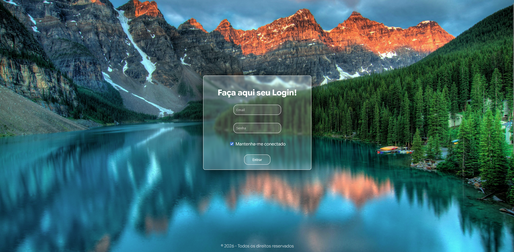

## 🖥️ TELA DE LOGIN - PROJETO FRONTEND ##

Este projeto consiste no desenvolvimento de uma tela de login moderna e responsiva, criada com foco em experiência do usuário (UX) e design de interface (UI). A proposta foi oferecer uma primeira interação simples, intuitiva e visualmente agradável, garantindo que o usuário consiga acessar a aplicação de forma rápida e sem fricções.

## 🎯 OBJETIVO ##

Criar uma interface que una simplicidade, usabilidade e beleza, facilitando o acesso do usuário e transmitindo confiança logo no primeiro contato.

## 🚧 DESAFIOS ENFRENTADOS ##

Um dos principais desafios foi trabalhar com uma imagem de fundo rica em detalhes, mantendo a legibilidade dos campos e textos através do controle cuidadoso de contraste, hierarquia visual e uso de transparência.
Também foi essencial encontrar o equilíbrio entre estética e usabilidade, evitando excessos visuais que distraíssem o usuário da ação principal.
Além disso, o layout foi ajustado para garantir responsividade, com uma experiência consistente tanto em desktops quanto em dispositivos móveis.

##🛠️ TECNOLOGIAS UTILIZADAS##

O projeto foi desenvolvido com HTML5 e CSS3, seguindo boas práticas de organização e estruturação de código para garantir manutenção e escalabilidade.

##✨ APRENDIZADOS##

Este projeto reforçou a importância de decisões visuais alinhadas às necessidades do usuário e destacou como detalhes de design impactam diretamente a experiência final, tornando a interface eficiente, acessível e agradável.

